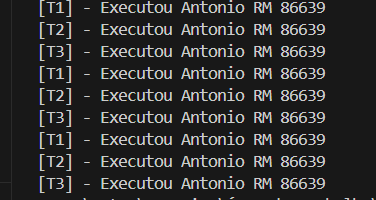

# ESP32 FreeRTOS Semaphore Demo

This project demonstrates the use of a **binary semaphore** in FreeRTOS running on an ESP32 to coordinate multiple tasks.

## Overview

Three tasks (`Task1`, `Task2`, `Task3`) share a common resource (the console output), ensuring that only one task executes at a time through semaphore control.

## Features

- Creation of three concurrent tasks in FreeRTOS
- Task synchronization using a binary semaphore
- Ordered printing to the console, avoiding simultaneous access conflicts
- Simple and practical example of synchronization in embedded systems

## Code Structure

- **`app_main()`**
  - Initializes the binary semaphore
  - Creates the three tasks (`vTask1`, `vTask2`, `vTask3`)
- **`vTask1`, `vTask2`, `vTask3`**
  - Attempt to acquire the semaphore (`xSemaphoreTake`)
  - Perform a critical action (printing to the console)
  - Release the semaphore (`xSemaphoreGive`)
  - Wait briefly to allow other tasks to acquire the semaphore

## Requirements

- ESP32 board
- ESP-IDF development framework
- FreeRTOS (included in ESP-IDF)

## Results

